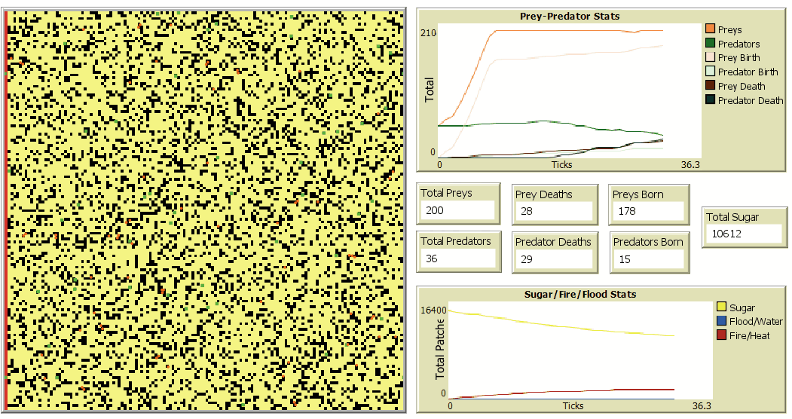
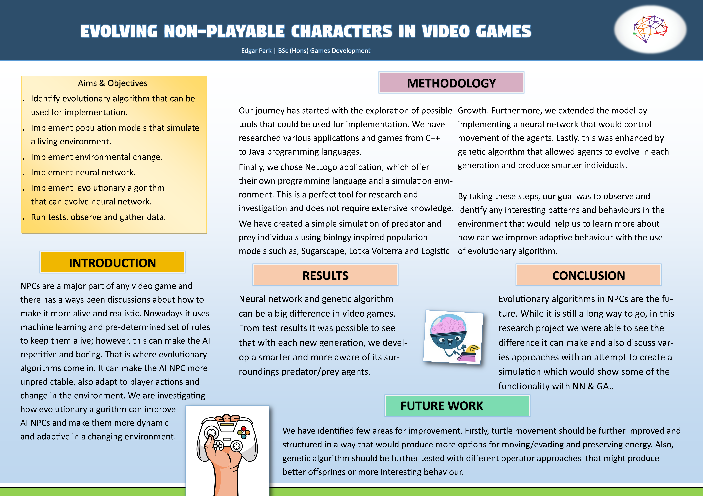

# ALife-Honours
### Edinburgh Napier University honours project for BSc(Hons) Games Development course.  
#### Timeframe: September 2023 - April 2024
> Research Question: How can evolutionary algorithm be used in creating a more dynamic and adaptive agent behaviour in a video game world where environmental change has impact on life?  
* Software used for creating simulations: NetLogo
* The simulation has two environments:
* 1: Fire/Heat effect. This will burn patches and make food sources inedible. Agents can still walk on burnt patches but will lose energy and eventually die without finding food.
* 2: Flood/Water effect. This will simulate soaked food that becomes inedible, also no agent can walk over water or walk and die.
* The main goal is to train and evolve agents over generations; therefore, they should learn to survive and adapt faster to extreme environmental conditions (wildfire/flooding).
###### There are 4 different simulations that are used for testing against each other
 1. Full simulation with NN/GA, predator/prey agents and environmental change in effect.
 2. A simulation without any environmental change.
 3. A simulation without any predators.
 4. A simulation without NN/GA. 

 

After further research, it was determined that NetLogo cannot handle heavy computing and therefore, the simulations with neural network and genetic algorithm will not produce any valuable data.
NetLogo will simply become very slow as the number of agents increase. 
 
In conclusion, we have answered the main research question and identified the EA that could be used in evolving AI NPCs. We only require a software that could handle neuroevolution and run the simulations smoothly; therefore, through observations and valuable data provided we could confirm that this theory is correct. 
 
**06/07/24** - After further research, we determined that NetLogo is not powerful enough to run heavy simulations smoothly. Therefore, alternative simulation environment should be chosen. 
 
  
